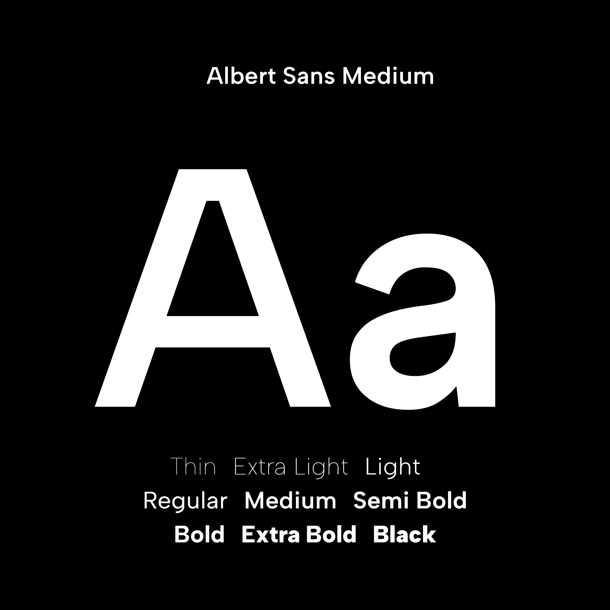

# The Albert Sans Font Project 

[![][Fontbakery]](https://usted.github.io/Albert-Sans/fontbakery/fontbakery-report.html)
[![][Universal]](https://usted.github.io/Albert-Sans/fontbakery/fontbakery-report.html)
[![][GF Profile]](https://usted.github.io/Albert-Sans/fontbakery/fontbakery-report.html)
[![][Outline Correctness]](https://usted.github.io/Albert-Sans/fontbakery/fontbakery-report.html)
[![][Shaping]](https://usted.github.io/Albert-Sans/fontbakery/fontbakery-report.html)

[Fontbakery]: https://img.shields.io/endpoint?url=https%3A%2F%2Fraw.githubusercontent.com%2Fusted%2FAlbert-Sans%2Fgh-pages%2Fbadges%2Foverall.json
[GF Profile]: https://img.shields.io/endpoint?url=https%3A%2F%2Fraw.githubusercontent.com%2Fusted%2FAlbert-Sans%2Fgh-pages%2Fbadges%2FGoogleFonts.json
[Outline Correctness]: https://img.shields.io/endpoint?url=https%3A%2F%2Fraw.githubusercontent.com%2Fusted%2FAlbert-Sans%2Fgh-pages%2Fbadges%2FOutlineCorrectnessChecks.json
[Shaping]: https://img.shields.io/endpoint?url=https%3A%2F%2Fraw.githubusercontent.com%2Fusted%2FAlbert-Sans%2Fgh-pages%2Fbadges%2FShapingChecks.json
[Universal]: https://img.shields.io/endpoint?url=https%3A%2F%2Fraw.githubusercontent.com%2Fusted%2FAlbert-Sans%2Fgh-pages%2Fbadges%2FUniversal.json

Albert Sans is a modern geometric sans serif family, inspired by the type-characteristics of scandinavian architects and designers in the early 20th century.
The Albert Sans family includes nine weights (Thin to Black) in two widths (Normal and Narrow).

Designed by the Danish type designer Andreas Rasmussen from a.Foundry.

## Building

Fonts are built automatically by GitHub Actions - take a look in the "Actions" tab for the latest build.

If you want to build fonts manually on your own computer:

* `make build` will produce font files.
* `make test` will run [FontBakery](https://github.com/googlefonts/fontbakery)'s quality assurance tests.
* `make proof` will generate HTML proof files.

The proof files and QA tests are also available automatically via GitHub Actions - look at [https://usted.github.io/Albert-Sans](https://usted.github.io/Albert-Sans).

## Changelog

When you update your font (new version or new release), please report all notable changes here, with a date.
[Font Versioning](https://github.com/googlefonts/gf-docs/tree/main/Spec#font-versioning) is based on semver. 
Changelog example:

**12 Aug 2021. Version 1.00**
- Initial release

**28 Aug 2021. Version 1.01**
- Outline corrections
- Stem corrections
- Angle adjustments

**30 Aug 2021. Version 1.02**
- Updated outlines
- Two new glyphs added
- Spacing adjustments

**02 Sep 2021. Version 1.03**
- Minor glyph width adjustments
- Minor spacing adjustments

**23 Sep 2021. Version 1.10**
- Glyph width adjustments
- New ampersand and alternates added

**06 Nov 2021. Version 1.11**
- Fixed a, s, S
- Improved OT features

**20 Nov 2021. Version 1.20**
- Minor weight adjustments
- A variety of new glyphs to support more languages 

**30 Dec 2021. Version 1.21**
- Updated kerning
 
**25 Feb 2022. Version 1.22**
- Minor adjustments

**13 Mar 2022. Version 1.23**
- Minor adjustments

**11 Apr 2022. Version 1.24**
- Minor adjustments

**23 May 2022. Version 1.25**
- Minor adjustments

**01 Mar 2024. Version 1.3**
- Added Width-axis with Narrow
- Spacing adjustments
- Extensive kerning update
- Added glyphs, including tabular numbers
- Glyphs adjustments

## License

This Font Software is licensed under the SIL Open Font License, Version 1.1.
This license is copied below, and is also available with a FAQ at
https://scripts.sil.org/OFL

## Repository Layout

This font repository structure is inspired by [Unified Font Repository v0.3](https://github.com/unified-font-repository/Unified-Font-Repository), modified for the Google Fonts workflow.
